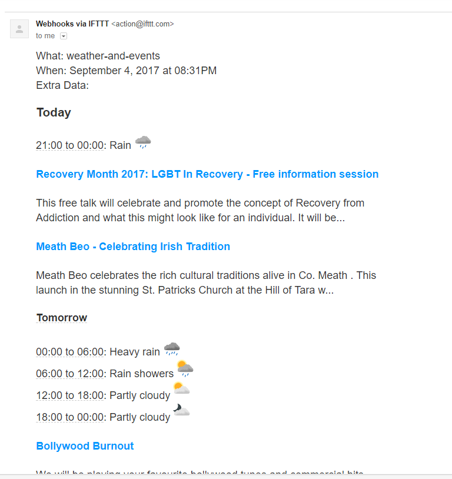

# weather-and-events webtask
A webtask.io script to send a daily email listing the local weather and events for the next 7 days

# Usage

1. Create an IFTTT applet which sends an email when a WebRequest is received.  You can do this through the IFTTT 'platform', which is free to use. 
   - create a new applet
   - under triggers, add "webhooks > receive a web request". pick a unique event name
   - under actions, add "email > send me an email"
   - save, and make note of the url for the applet 
2. Sign up for webtask.io, and download the cli. `npm install wt-cli -g`. More info here: [https://webtask.io/cli](https://webtask.io/cli). Next, you'll need to create a new webtask, setting the code in this repo as the source. You need to pass in 5 parameters, or "secrets"
   - `city` - the name of the city you live in, or the one nearest to you 
   - `country` - the name of your country 
   - `weatherLocation` - the last three nodes of your local yr.no weather page Url. For example, the url for Dublin, Ireland is https://www.yr.no/place/Ireland/Leinster/Dublin/, so you'll pass in "Ireland/Leinster/Dublin". Even though we know the city and country and we might know the region, it's safer just to get the end of the Url directly from yr.no, just in case. 
   - `eventBriteOAuthToken` - a permanent Oauth token which you can generate from EventBrite once you log in to their developer portal and create an app  
3. Create your wt, with a cron job / schedule. use the source of this repo as your code file, and pass in the secrets above using the `-s` parameter

  `wt cron schedule -n myCronSchedule 24h .\weatherandevents.js -s eventBriteOAuthtoken="MyEventBriteOAuthToken" -s city="Dublin" -s country="Ireland" -s weatherLocation="Ireland/Leinster/Dublin" -s IFTTTUrl="MyIFTTTWebHookUrl"`

With the above command, you'll get an email every 24 hours with a weather and events for your chosen location for the next 7 days. Here's a preview:

   

# Credits

yr.no icons are sourced from [YR/weather-symbols](https://github.com/YR/weather-symbols) 